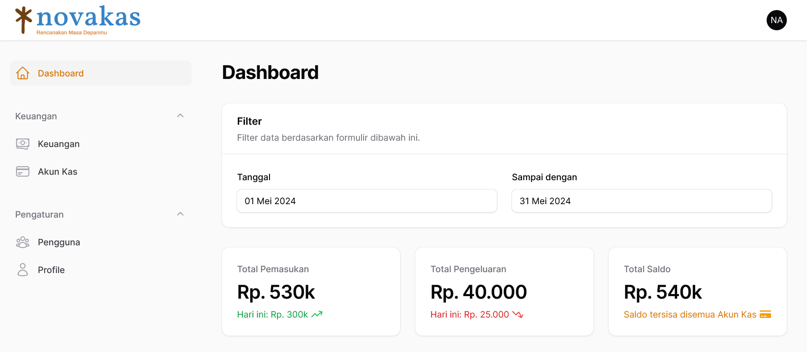

# Nova Kas: Your Financial Management Solution

Hi Future Developer!

Welcome to my latest project! Nova Kas is a modern web application crafted using Laravel and Filament, designed to revolutionize the way you manage your finances. With its intuitive interface and powerful features, Nova Kas simplifies financial management, empowering you to take control of your financial journey with ease.

Nova Kas offers a seamless and user-friendly experience for managing your personal finances. Whether it's tracking income and expenses, managing cash accounts, or generating insightful reports and dashboards, Nova Kas provides the tools you need to plan for a secure and prosperous financial future.

Thank you for your interest. Happy coding!

## ✨ Features:

- 💼 Financial Management
- 💰 Cash Account Management
- 📊 Report Management
- 📊 Dashboard
- 📧 Email Notifications
- 👥 Multi-User and Role Management
- 📱 Full Responsiveness
- 🎨 Good Design and User Friendly
- 🆓 Free to Use
- ✨ So much more...

## Powering Up with an Electrifying Tech Stack! ⚡

This project is fueled by an electrifying lineup of cutting-edge technologies:
- [Laravel v10](https://laravel.com/docs/10.x/) - Freeing you to create without sweating the small things.
- [Filament v3](https://filamentphp.com/) - A collection of beautiful full-stack components. The perfect starting point for your next app.
- [Tailwind CSS](https://tailwindcss.com/) - Rapidly build modern websites without ever leaving your HTML.

Prepare for an exhilarating ride through innovation and efficiency with this impressive tech stack!

## Licensing Groove🕺

This project is grooving to the rhythm of the [MIT License](https://github.com/novaardiansyah/novakas/blob/main/LICENSE)! 🎉

## Let's Connect! 📞

Need to chat? Feel free to drop me a line via [Email](mailto:novaardiansyah78@gmail.com) or hit me up on [WhatsApp](https://wa.me/6289506668480?text=Hi%20Nova,%20I%20have%20a%20question%20about%20your%20project%20on%20GitHub:%20https://github.com/novaardiansyah/novakas/). I'm just a message away, ready to groove with you! 📩

## Sneak Peek 🌟

Get a glimpse of the app's enchanting world by exploring the current progress at [https://kas.nova-it.my.id/public/](https://kas.nova-it.my.id/public/). Feast your eyes on these snapshots that showcase the app's dynamic essence:

  
  

## Project Status 🚀 

